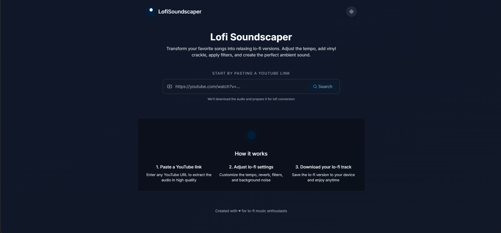

# Welcome to your Lovable project
 
 ## Project info
 # 🎵 Lofi Soundscaper
 
 Transform any YouTube video into a chill lo-fi track with customizable audio effects!
 
 
 ## ✨ What is Lofi Soundscaper?
 
  Lofi Soundscaper is a web application that lets you convert regular music from YouTube into relaxing lo-fi versions. It's perfect for creating study music, sleep sounds, or just chilling out with some mellow beats.
 
 ### Features
 
 Changes made via Lovable will be committed automatically to this repo.
 - 🎬 **YouTube Integration**: Paste any YouTube link to extract the audio
 - 🎛️ **Customizable Effects**: Adjust tempo, reverb, filtering, vinyl noise, and bit crushing
 - 🎧 **Real-time Preview**: Listen to your lo-fi creation before downloading
 - 📱 **Responsive Design**: Works on desktop and mobile devices
 - 🌙 **Dark Mode**: Easy on the eyes during late-night study sessions
 
 **Use your preferred IDE**
 ## 🚀 How to Use
 
 If you want to work locally using your own IDE, you can clone this repo and push changes. Pushed changes will also be reflected in Lovable.
 1. **Paste a YouTube URL** in the input box
 2. **Wait** for the audio to extract (this may take a moment)
 3. **Adjust the lo-fi settings** to your liking:
    - Tempo: Slows down the track for that classic lo-fi vibe
    - Reverb: Adds spaciousness and atmosphere
    - Filter: Applies low-pass filtering for warmth
    - Vinyl Noise: Adds crackling for authentic vintage sound
    - Bitcrusher: Creates that characteristic lo-fi resolution
 4. **Choose from presets** or create your own custom sound
 5. **Listen** to the processed audio with the built-in player
 6. **Download** your lo-fi masterpiece when you're happy with it
 
 The only requirement is having Node.js & npm installed - [install with nvm](https://github.com/nvm-sh/nvm#installing-and-updating)
 ## 🛠️ Technical Details
 
 Follow these steps:
 The application consists of two parts:
 
 ```sh
 # Step 1: Clone the repository using the project's Git URL.
 git clone <YOUR_GIT_URL>
 ### Frontend
 - Built with React, TypeScript, and Tailwind CSS
 - Features a responsive design with dark mode support
 - Uses Web Audio API for audio visualization
 
 # Step 2: Navigate to the project directory.
 cd <YOUR_PROJECT_NAME>
 ### Backend
 - Node.js server using Express
 - YouTube audio extraction with youtube-dl-exec
 - Audio processing with FFmpeg for applying lo-fi effects
 - RESTful API for communication between client and server
 
 # Step 3: Install the necessary dependencies.
 npm i
 ## 🔧 Development Setup
 
 # Step 4: Start the development server with auto-reloading and an instant preview.
 npm run dev
 ```
 ### Prerequisites
 - Node.js (v16 or higher)
 - FFmpeg installed on your system
 - Python (for youtube-dl)
 
 **Edit a file directly in GitHub**
 ### Setup Instructions
 
 - Navigate to the desired file(s).
 - Click the "Edit" button (pencil icon) at the top right of the file view.
 - Make your changes and commit the changes.
 1. Clone the repository
 2. Install frontend dependencies:
    ```
    npm install
    ```
 3. Start the frontend development server:
    ```
    npm run dev
    ```
 4. Navigate to the server directory and install backend dependencies:
    ```
    cd server
    npm install
    ```
 5. Start the backend server:
    ```
    npm start
    ```
 
 **Use GitHub Codespaces**
 ## 💡 Project Inspiration
 
 - Navigate to the main page of your repository.
 - Click on the "Code" button (green button) near the top right.
 - Select the "Codespaces" tab.
 - Click on "New codespace" to launch a new Codespace environment.
 - Edit files directly within the Codespace and commit and push your changes once you're done.
 Lofi Soundscaper was created out of a love for lo-fi music and the desire to make it easy for anyone to create their own relaxing tracks from their favorite songs. The project combines audio processing techniques with a simple, intuitive interface to make lo-fi creation accessible to everyone.
 
 ## What technologies are used for this project?
 ## 📝 License
 
 This project is built with .
 This project is open-source and available under the MIT License.
 
 - Vite
 - TypeScript
 - React
 - shadcn-ui
 - Tailwind CSS
 ## 🙏 Acknowledgements
 
 ## How can I deploy this project?
 - Built with [React](https://reactjs.org/), [Tailwind CSS](https://tailwindcss.com/), and [shadcn/ui](https://ui.shadcn.com/)
 - Audio processing powered by [FFmpeg](https://ffmpeg.org/)
 - YouTube extraction via [youtube-dl-exec](https://github.com/microlinkhq/youtube-dl-exec)
 
 Simply open [Lovable](https://lovable.dev/projects/36b17fdb-b051-45f1-a556-115f39bea9af) and click on Share -> Publish.
 ---
 
 ## I want to use a custom domain - is that possible?
 
 We don't support custom domains (yet). If you want to deploy your project under your own domain then we recommend using Netlify. Visit our docs for more details: [Custom domains](https://docs.lovable.dev/tips-tricks/custom-domain/)
 Made with ♥ for lo-fi music enthusiasts everywhere
